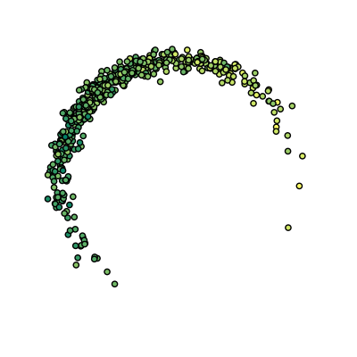

# Clusterpolate

## Inter- and extrapolation for clustered data

Traditional approaches for inter- and extrapolation of scattered data
work on a filled rectangular area surrounding the data points or in
their filled convex hull. However, scattered data often consists of
different clusters of irregular shapes and usually contains areas where
there simply is no data. Forcing such data into a traditional inter-
or extrapolation scheme often does not lead to the desired results.

Heatmaps, on the other hand, deal well with scattered data but often do
not provide real interpolation: Instead they usually use raw sums of
kernel functions which overestimate the target value in densely
populated areas.

Clusterpolation is a hybrid inter- and extrapolation scheme to fix this.
It uses kernel functions for a weighted inter- and extrapolation of
local values, as well as for a density estimation of the data. The
latter is used to assign a membership degree to clusterpolated points:
Points with a low membership degree lie in an area where there's just
not enough data.

## Example

Given scattered data like

the `clusterpolate.image` function produces

Note how the values are cleanly interpolated even within dense regions
and how extrapolation only occurs close to existing data points.

Of course you can also use clusterpolation on your data without
generating any images: simply use the `clusterpolate.clusterpolate`
function.

## Installation

    pip install clusterpolate

