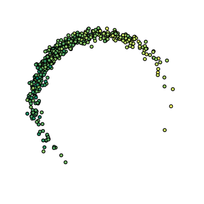

Clusterpolate
#############

**Inter- and Extrapolation for Scattered Data**

Traditional approaches for inter- and extrapolation of scattered data
work on a filled rectangular area surrounding the data points or in
their filled convex hull. However, scattered data often consists of
different clusters of irregular shapes and usually contains areas where
there simply is no data. Forcing such data into a traditional inter-
or extrapolation scheme often does not lead to the desired results.

Heatmaps, on the other hand, deal well with scattered data but often do
not provide real interpolation: Instead they usually use raw sums of
kernel functions which overestimate the target value in densely
populated areas.

Clusterpolation is a hybrid inter- and extrapolation scheme to fix this.
It uses kernel functions for a weighted inter- and extrapolation of
local values, as well as for a density estimation of the data. The
latter is used to assign a membership degree to clusterpolated points:
Points with a low membership degree lie in an area where there's just
not enough data.

Installation
============
The ``clusterpolate`` package is available from PyPI_ and can be installed via
pip_::

    pip install clusterpolate

.. _PyPI: https://pypi.python.org/pypi/clusterpolate
.. _pip: https://pip.pypa.io/

Quickstart
==========

Use :py:func:`~.image` to generate images using clusterpolated data::

    import numpy as np
    from matplotlib.cm import summer
    import matplotlib.pyplot as plt
    from clusterpolate import image

    # Generate some data
    n = 500
    angles = np.random.normal(0, 0.75, n) - 0.2 * np.pi
    radii = np.random.normal(1, 0.05, n)
    points = np.vstack((radii * np.sin(angles),
                       radii * np.cos(angles))).T
    values = np.sin(angles) + np.random.normal(0, 0.5, n)
    size = (500, 500)
    area = ((-1.5, 1.5), (1.5, -1.5))

    # Plot raw data
    plt.scatter(points[:, 0], points[:, 1], c=values, cmap='summer')
    plt.axis('equal')
    plt.axis([-1.5, 1.5, -1.5, 1.5])
    plt.gca().set_aspect('equal', adjustable='box')
    plt.axis('off')
    plt.show()

    # Generate clusterpolated image
    img = image(points, values, size, area, radius=0.2,
                colormap=summer)[3]
    img.save('clusterpolated.png')

Raw data:

Clusterpolated data:

.. image:: clusterpolated.png

Note how the values are cleanly interpolated even within dense regions and how extrapolation only occurs close to existing data points.

Of course you can also use clusterpolation on your data without generating any images: simply use :py:func:`~.clusterpolate`.

API Reference
=============

.. automodule:: clusterpolate
    :members:
    :undoc-members:
    :special-members: __init__

Development
===========
The code for this package can be found `on GitHub <https://github.com/torfsen/clusterpolate>`_. It is available under the `MIT license <http://opensource.org/licenses/MIT>`_.

History
=======
:0.2.0:
    * Support for multiprocessing.

:0.1.0:
    * Initial release.

